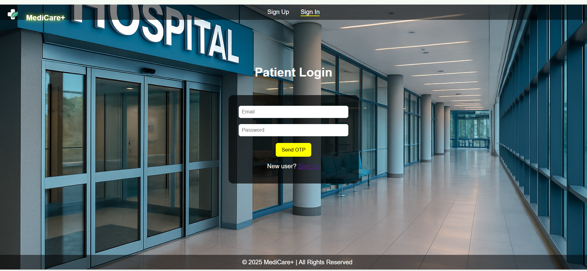
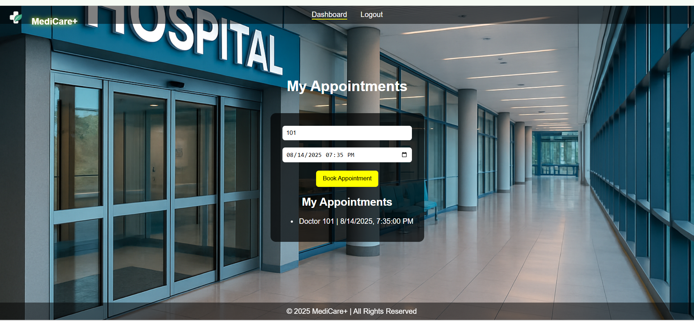
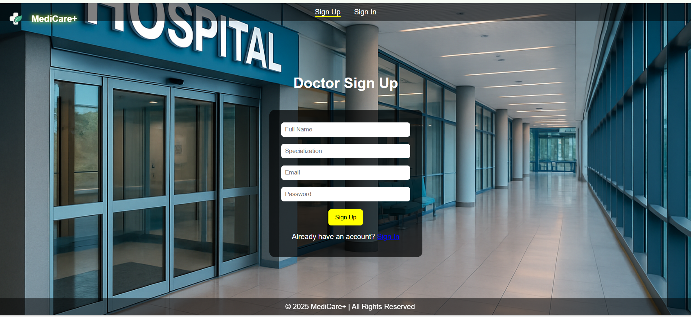

# MediCare+

A multi-page medical appointment system with:

- 🧑‍⚕️ Doctor & Patient Login (OTP via Email)
- 📅 Appointment booking and management
- ✅ Dashboard for doctors to confirm/cancel appointments
- 💌 Email OTP authentication
- 💾 MySQL database

## 📂 Project Structure

medical-appointment/
├── server.js
├── public/
└── sql/

## 🚀 Features

1. Patient Sign Up / Login with OTP
2. Doctor Sign Up / Login with OTP
3. Appointment Booking
4. Doctor Dashboard with Status Updates

---
# 📸 Screenshots

### 1️⃣ Patient Login

### 2️⃣ Patient Dashboard

### 3️⃣ Doctor Dashboard

**Live Demo (Local)**:  
`http://localhost:5000/`
